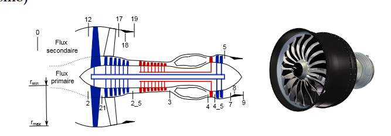

# MODELE TURBOFAN DOUBLE FLUX

Inspiré du moteur LEAP



## Utilisation

```python
# Importer le moteur

from TurboFan_model import TurboFan

# Créer une instance du moteur

OPR = 40 # Total compression ratio
Tt4 = 1600 # K Total temp fafter combustion chamber
BPR = 11 # also called lambda : Rmax/Rmin
PIf = 1.4 # Fan compression ratio

engine = TurboFan(OPR, Tt4, BPR, PIf)

# Vous pouvez désormais lire toutes les valeurs qui vous plaisent !

print(engine.Pt2) # Total pressure @ 2
print(engine.ETA_total) # Rendement total moteur

```

## Why ?

Made this model for the aero & propulsion course. Made it in python so i could plot.

Sharing it for fellow students
